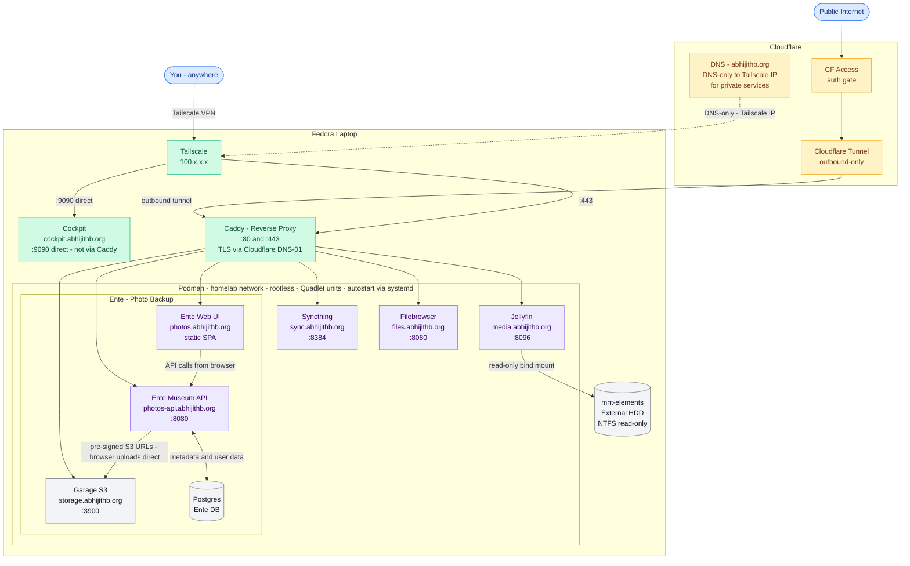

```mermaid
flowchart TD
    YOU(["You - anywhere"]):::external
    PUBLIC(["Public Internet"]):::external

    subgraph CF["Cloudflare"]
        CF_DNS["DNS - abhijithb.org\nDNS-only to Tailscale IP\nfor private services"]:::cf
        CF_ACCESS["CF Access\nauth gate"]:::cf
        CF_TUNNEL["Cloudflare Tunnel\noutbound-only"]:::cf
        CF_ACCESS --> CF_TUNNEL
    end

    subgraph LAPTOP["Fedora Laptop"]
        TS["Tailscale\n100.x.x.x"]:::infra
        COCKPIT["Cockpit\ncockpit.abhijithb.org\n:9090 direct - not via Caddy"]:::infra
        CADDY["Caddy - Reverse Proxy\n:80 and :443\nTLS via Cloudflare DNS-01"]:::infra

        subgraph NET["Podman - homelab network - rootless - Quadlet units - autostart via systemd"]
            SYNC["Syncthing\nsync.abhijithb.org\n:8384"]:::svc
            FB["Filebrowser\nfiles.abhijithb.org\n:8080"]:::svc
            JELLYFIN["Jellyfin\nmedia.abhijithb.org\n:8096"]:::svc

            subgraph ENTE_GROUP["Ente - Photo Backup"]
                ENTE_WEB["Ente Web UI\nphotos.abhijithb.org\nstatic SPA"]:::svc
                ENTE_API["Ente Museum API\nphotos-api.abhijithb.org\n:8080"]:::svc
                GARAGE["Garage S3\nstorage.abhijithb.org\n:3900"]:::store
                POSTGRES[("Postgres\nEnte DB")]:::store
            end
        end

        HDD[("mnt-elements\nExternal HDD\nNTFS read-only")]:::store
    end

    YOU -->|"Tailscale VPN"| TS
    PUBLIC --> CF_ACCESS
    CF_DNS -.->|"DNS-only - Tailscale IP"| TS
    CF_TUNNEL -->|"outbound tunnel"| CADDY

    TS -->|":9090 direct"| COCKPIT
    TS -->|":443"| CADDY

    CADDY --> SYNC
    CADDY --> FB
    CADDY --> JELLYFIN
    CADDY --> ENTE_WEB
    CADDY --> ENTE_API
    CADDY --> GARAGE

    ENTE_WEB -->|"API calls from browser"| ENTE_API
    ENTE_API <-->|"metadata and user data"| POSTGRES
    ENTE_API -->|"pre-signed S3 URLs - browser uploads direct"| GARAGE
    JELLYFIN -->|"read-only bind mount"| HDD

    classDef external fill:#dbeafe,stroke:#3b82f6,color:#1e3a8a
    classDef cf fill:#fef3c7,stroke:#f59e0b,color:#78350f
    classDef infra fill:#d1fae5,stroke:#10b981,color:#064e3b
    classDef svc fill:#ede9fe,stroke:#8b5cf6,color:#3b0764
    classDef store fill:#f3f4f6,stroke:#6b7280,color:#111827
```
